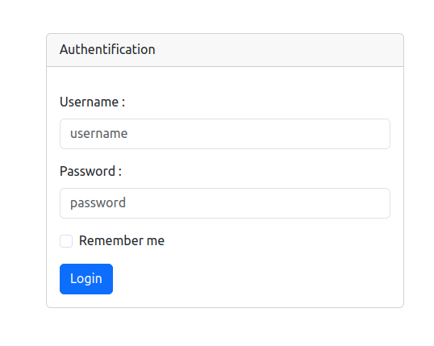
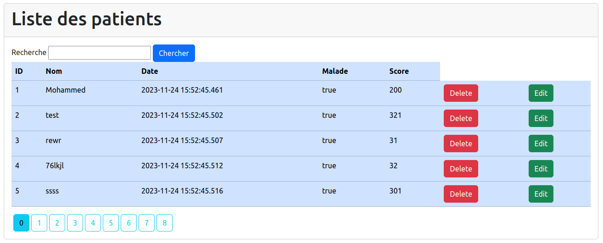
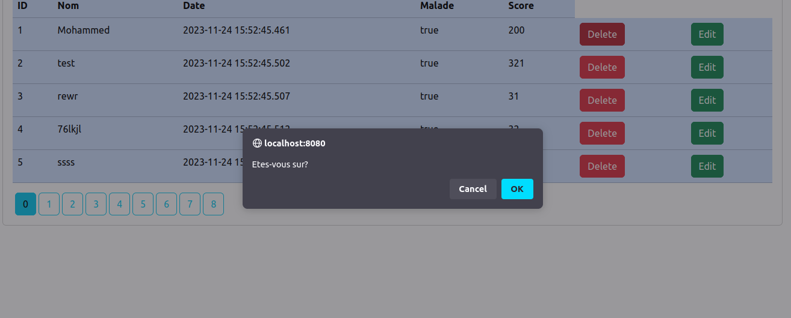
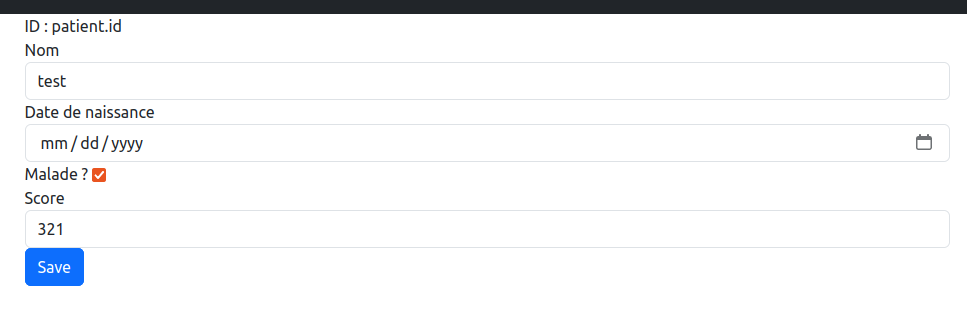
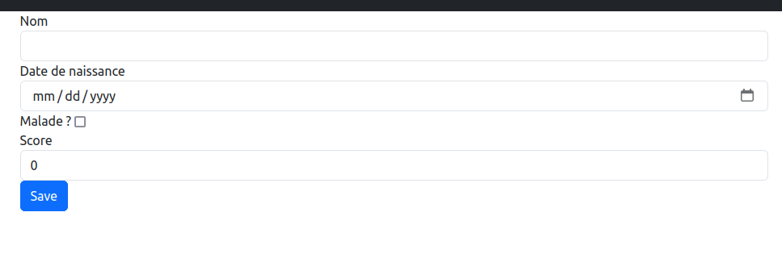
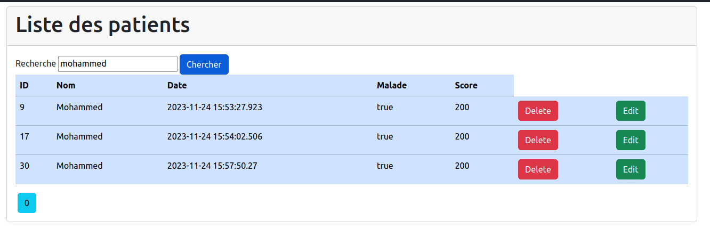
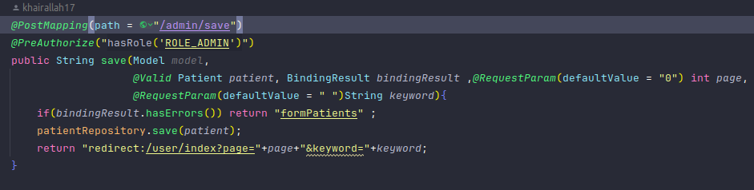
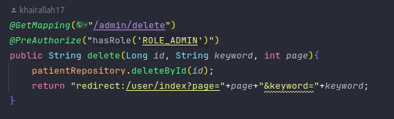
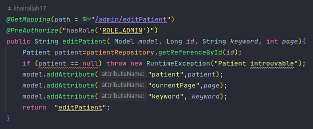

# Introduction

Ce projet se concentre sur la création d'une application web sécurisée dédiée à la gestion complète des dossiers patients. Il exploite les fonctionnalités des frameworks Spring Boot et Spring Security pour établir une base solide, permettant des fonctionnalités essentielles telles que la création, la consultation, la modification et la suppression des données patients.

Initialement, l'objectif est de mettre en place une application Spring Boot mettant en valeur la flexibilité et la solidité du framework. La sécurité est une priorité, avec la mise en place de trois stratégies d'authentification distinctes :

- InMemoryAuthentication
- JdbcAuthentication
- UserDetailsService

Un aspect remarquable de ce projet réside dans la gestion de deux bases de données - H2 et MySQL. Cela souligne l'adaptabilité de Spring Boot pour se connecter à différentes sources de données.
## Périmètre du Projet

Développer une application web JEE utilisant Spring MVC, Thymeleaf et Spring Data JPA pour gérer les dossiers patients. Les principales fonctionnalités de l'application incluent :

- Stocker les données dans H2 DataBase et MySQL
- Afficher les informations des patients
- Mettre en œuvre la pagination pour le traitement des données
- Autoriser les recherches de patients
- Ajouter, modifier et supprimer des dossiers patients
- Garantir la sécurité des données utilisateur
- Gérer les droits d'accès

## Objectifs

- Créer un projet Spring Boot avec les dépendances Web, Spring Data JPA, H2, Lombok, Thymeleaf et MySQL
  - Définir l'entité JPA pour les patients
  - Établir l'interface PatientRepository en utilisant Spring Data
  - Configurer l'application pour se connecter facilement à H2 Database ou MySQL
  - Développer le contrôleur Spring MVC
  - Créer des interfaces utilisateur avec Thymeleaf
- Mettre en place des mesures de sécurité solides en intégrant Spring Security et ses trois stratégies d'authentification :
  - InMemoryAuthentication 
  - JdbcAuthentication
  - UserDetailsService

## Fonctionnalités
  - login
  - 
  - liste des patient et pagination
  
  - supprimer un patient
  
  - modifier les information d'un patient
  
  - ajouter un patient
  
  - Rechercher un patient
  

## Fonctionnalités en code
### Fonctionnalités ADMIN
ces fonctionnalités est juste pour admin ce qui fait on a ajouter l'annotaion **@PreAuthotize('ROLE_ADMIN')** pour donner access just au l'admin
  - ajouter un patient:
  
  - supprimer un patient:
  
  - editer un patient
  

## SPRING SECURITY
cette parite qui a but de creer un couche de protection qui sert a gerer l'authentification 